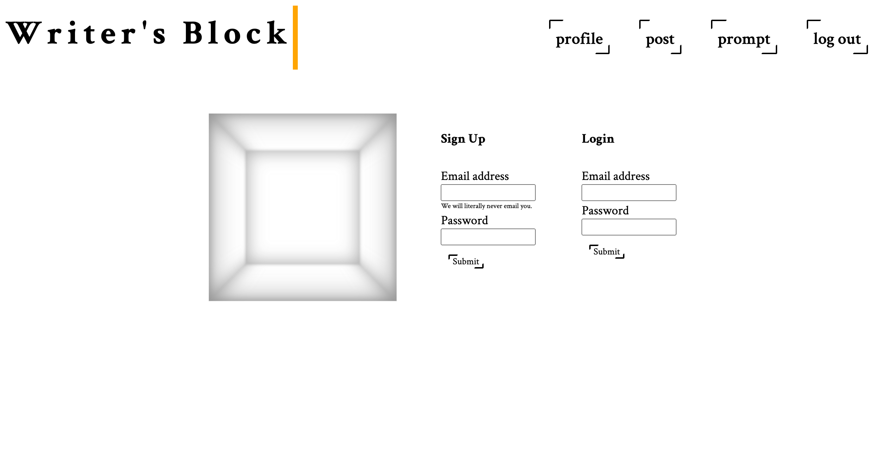

# Project 2- Group 9
Henry Vernon, Broc Crook, Zoe Chalk, Stephanie Barnhouse

## Writer's Block

Writer's Block is an application designed to help writers who are experiencing a creative slowdown. Users are asked to create a profile or sign in and given random writing prompts and have the ability to save their prompts to view at a later time.

This application was created using handlebars, CSS, Javascript, and a writer's block database. Dependencies include: bcrypt, connect-session-sequelize, dotenv, express, express-handlebars, express-session, mysql2, seed, sequelize.

Github Repository: https://github.com/zchalk/WritersBlock 

Deployed: https://writers--block.herokuapp.com/ 

## User Story

As a user I am stuck on what to write next. I want to be given random writing prompts with the ability to save what I have written and review it at a later time.
